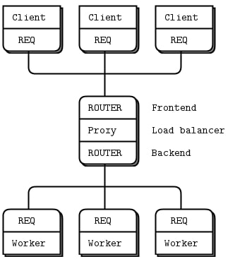
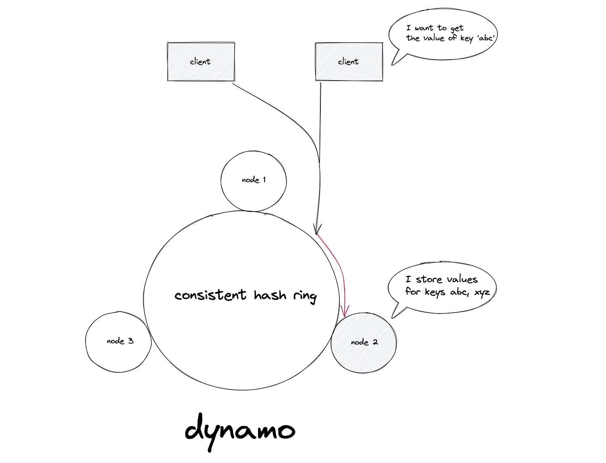

# SDLE Assignment

## Project Description
This project implements a local-first, cloud-based shopping list application designed to explore distributed systems concepts. Developed as part of the Large Scale Distributed Systems course, the application enables collaborative shopping list management with  data synchronization using Conflict-free Replicated Data Types (CRDTs), ensuring high availability and concurrent user interactions across multiple devices.
Here's the [assignment specification](doc/SDLE_ShoppingList.pdf).

## Group T02G11 Members

1. Adriano Machado ([up202105352@up.pt](mailto:up202105352@up.pt))
2. Ana Carolina Brandão ([up202004461@up.pt](mailto:up202004461@up.pt))
3. Francisco Ana ([up202108762@up.pt](mailto:up202108762@up.pt))
4. Inês Oliveira ([up202103343@up.pt](mailto:up202103343@up.pt))

---

## How to Run the Project

### Server

```bash
gradle build
gradle run --args="server" --console=plain
```

### Client

```bash
gradle build
gradle run --args="client" --console=plain
```

---

## Project Architecture

This project is organized into the following packages:

### `data_structures`
This package contains the custom data structures utilized in the project, including two CRDTs (Conflict-free Replicated Data Types):

- **`AWORSet`**: Stores the list of items, allowing additions and removals while ensuring eventual consistency across replicas.
- **`BGCounter`**: Tracks the quantity of each item, using a bounded G-Counter.

Additionally, this package includes the `Item` and `ShoppingList` classes.

### `client`
Contains the classes that handle the client side of the application:

- **`Client`**: Manages the user interface (UI) and processes user inputs.
- **`CommunicationHandler`**: Manages communication with the server, handling requests and responses.

### `server`
Contains the server-side implementation:

- Implements a Load Balancer architecture using the `HashRing` class to distribute client requests among multiple worker servers.

---

## CRDTs: Conflict-Free Replicated Data Types

Conflict-free Replicated Data Types are distributed data structures designed to ensure eventual consistency. They allow independent updates across replicas without coordination, making them ideal for local-first applications.

### Implemented CRDTs

1. **`AWORSet`**:
    - Stores the list of items.
    - Allows addition and removal operations.
    - Uses vector clocks for conflict resolution, addressing the limitations of simple timestamps.
    - Merge operation is based on the union of sets, ensuring commutativity, associativity, and idempotence.

2. **`BGCounter`**:
    - Tracks the quantity of items.
    - Operates as a bounded G-Counter with a predefined limit on increments.
    - Merge operation uses the maximum value of counters, respecting the CRDT merge function properties.

---

## Client-Side Design

The client application employs two threads:

1. **Main Thread**: Handles user input and UI operations via the `Client` class.
2. **Communication Thread**: Manages communication with the server using the `CommunicationHandler` class, ensuring request-response interactions.

---

## Server-Side Design

We apply a Load Balancer architecture to efficiently distribute client requests among worker servers. The implementation uses **ZeroMQ** for inter-process communication and consists of the following components:



1. **Frontend**:
   - Listens to incoming client requests.
   - Uses a `FrontendHandler` class to route requests based on the `listId` extracted from the client messages. Based on the `listId`, we use the `HashRing` to determine the appropriate worker server.
   
2. **Backend**:
   - Manages communication with worker servers.
   - Utilizes a `BackendHandler` class to handle worker readiness and process responses.
   
3. **Workers**:
   - Execute the actual operations (read, write, delete) on shopping lists.
   - Each worker runs a `WorkerTask` to process client requests and synchronize data using CRDTs.

   
### HashRing
The `HashRing` class implements consistent hashing to efficiently distribute client requests among worker servers. This approach ensures load balancing and fault tolerance in a distributed system.


